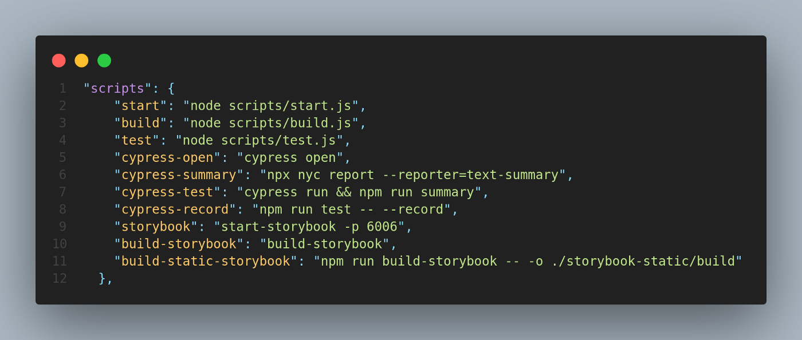

# Project Title

Commit Feed App

## Table of Content:

-   [About The App](#about-the-app)
    The application is about viewing the github commits for the user and his repositories. The user has to enter the username or email id, and repository name. If it exists in github, the commits will be listed, else the 404 page should be visible.
-   [Screenshots](#screenshots)

-   [Technologies](#technologies)

    1.  React, Redux for Client side UI, and for the state management.
    2.  Storybook for building UI components and pages in isolation and visually test components.
    3.  Followed the TDD, BDD approach by using enzyme, sinon, chai, @testing-library/react and jest tools.
    4.  Followed the integration test using the Cypress.io
    5.  For more code readability and for optimized code, followed the linting process (ESLint & SaSS Lint). And mainly used the Typescript for typechecking and to follow OOPS concepts like enums, interface, types, etc., to reduce the run time errors, and other issues which are found in native applications.
    6.  SCSS for more enhanced styling syntax and minimal code, and re-usable variable/classes.
    7.  I18next for internationalization.

-   [Setup](#setup)

        1. This project was bootstrapped with [Create React App](https://github.com/facebook/create-react-app), using the [Redux](https://redux.js.org/) and [Redux Toolkit](https://redux-toolkit.js.org/) TS template.
           "npx create-react-app commit-feed-app — template redux-typescript"
        2. Then we have done the [storybook] setup using command [npx sb init](https://storybook.js.org/docs/react/get-started/install)
           2.1 Update package.json with storybook commands.
           
        3. [Cypress](https://www.cypress.io/) setup done through by installing the package "npm install cypress -D", then next step is initializing the cypress.json with properties.
           
           Example: 
           3.1 Used package @cypress/code-coverage for code-coverage.
           3.2 Update babelrc like below and install the required packages
           
           3.3 Update the cypress/plugins/index.js file:
           
           3.4 Add the code-coverage summary commands in the package.json scripts section
           
        4. [Jest] for unit testing setup we need to follow the below steps.
           4.1 Create a [jest.config.json](https://jestjs.io/docs/configuration) in root folder, where we can mention the setupFiles, ignorepatterns etc.,
           4.2 In setupTests.js we can create the adapter, and common functions for our testing framework.
           
           4.3 For snapshot testing we are going to use react-test-renderer, so let's install it "npm install react-test-renderer -D"
           4.4 Now we will install enzyme, adapter, sinon and chai. "npm install enzyme @types/enzyme sinon @types/sinon chai @types/chai enzyme-adapter-react-17-updated -D"
           4.5 We will use istanbul for code coverage and set some threshold in jest.config.json to maintain quality of code
        5. [I18next](https://www.i18next.com/)
           5.1 Run command npm install i18next
        6. To setup SASS, run command "npm install sass -D"
        7. [Prettier](https://prettier.io/) Will use this for code formatting by creating .prettierrc.json in root folder. And install package "npm install prettier -D"
           
        8. Will use [husky](https://typicode.github.io/husky/#/?id=recipes) as our pre-commit hook and we will specify the commands which are to be executed when the developers commits the code, if all rules are getting passed will allow him to push to the repository. "npm install -D pretty-quick husky"
           8.1 To add any commands run "npx husky add .husky/pre-commit <Command>" to update .husky file. So by doing this whenever the developer tries to commit the changes it will check and give the status of it by that developer can fix the issues if any.
        9. [Linting] will use to analyse code for potential errors
           9.1 Scss-Lint: Create a .sasslintrc.json in the root folder and specify the sass rules, and call it in the package.json. "npm install scss-lint sass-lint-auto-fix -D"
           
           9.2 Typescript-ESlint: Install "npm i -D eslint typescript @typescript-eslint/parser @typescript-eslint/eslint-plugin" then create a .eslintrc.js and .eslintignore in root folder. eslintignore will ignore the paths/files from linting.
           
           Finally, update the .husky file with the below commands:
           
        10. i18n: is a powerful internationalization to provide multi language support
            10.1 Run "npm install react-i18next i18next -S" to install the package
            10.2 Create a config.ts in the i18n folder and specify the below config
            
            10.3 Import in root folder index.ts
            10.4 Import all messages in components using useTranslation hook.
            

-   [Approach](#approach)

                1.  Always follow the BDD, TDD approach Test case first, create a component/service spec files first, and list out the behaviour of component/service file using multple describe and it statement
                    describe('', () => {
                    it('', () => {

                        })

                    });
                    example: describe('Button', () => {
                let props: any;
                beforeEach(() => {
                    props = {
                        isPrimary: false,
                        type: 'button',
                        name: 'name',
                        value: 'value',
                    };
                });
                it('renders primary', () => {
                    const wrapper = renderer.create(<Button {...props} />).toJSON();
                    expect(wrapper).toMatchSnapshot();
                });
                it('renders secondary', () => {
                    const secondaryProps = { ...props, isPrimary: false };
                    const wrapper = renderer
                        .create(<Button {...secondaryProps} />)
                        .toJSON();
                    expect(wrapper).toMatchSnapshot();
                });
                it('should trigger click', () => {
                    const clickSpy = jest.fn();
                    const clickProps = { ...props, onClick: clickSpy };
                    render(<Button {...clickProps} />);
                    fireEvent.click(screen.getByText(/value/i));
                    expect(clickSpy).toHaveBeenCalledTimes(1);
                });

            });

            2. Then write the implementaion part of it, to make the test case to get succed
                Example:
                import React from 'react';
                import classNames from 'classnames';
                import './index.scss';

                interface ButtonProps {
                    type: 'button' | 'submit';
                    name: string;
                    value: string;
                    isPrimary: boolean;
                }
                const Button = (props: ButtonProps & React.HTMLProps<HTMLInputElement>): JSX.Element => {
                        const { isPrimary } = props;
                        const buttonType = classNames('btn btn-block', {
                        ['btn-primary']: isPrimary,
                        });
                        return <input className={buttonType} {...props} />;
                };

                Button.defaultProps = {
                    isPrimary: false,
                    type: 'button',
                };

                export default Button;

            3. Write the story, for visual test
                Example:
                    import React from 'react';
                    import { ComponentStory, ComponentMeta } from '@storybook/react';
                    import Button from '../app/common/Button';

                    export default {
                        title: 'Button',
                        component: Button,
                        argTypes: {},
                    } as ComponentMeta<typeof Button>;

                    const Template: ComponentStory<typeof Button> = (args) => <Button {...args} />;

                    export const Primary = Template.bind({});
                    Primary.args = {
                        isPrimary: true,
                        label: 'Button',
                        value: 'View',
                    };

                    export const Secondary = Template.bind({});
                    Secondary.args = {
                        label: 'Button',
                        value: 'View',
                    };

            4. Write the integration test using cypress
                Example: it('should render not found page', function () {
                            cy.visit('http://localhost:3000/');
                            cy.get('#username').clear();
                            cy.get('#username').type('sushma1988');
                            cy.get('#reponame').clear();
                            cy.get('#reponame').type('TheoryOFComputationNot');
                            cy.get('.btn').click();
                            cy.get('.notfound').should('exist');
                        });

-   [License](#license)
    MIT
